<div align="center">


# QuickPool

### Smart Ride Pooling Platform

<p align="center">
Intelligent route matching and group-based travel with safety systems, reputation management and automated ride formation.
</p>

<br>


<br><br>

<a href="#showcase">Showcase</a> •
<a href="#overview">Overview</a> •
<a href="#features">Features</a> •
<a href="#tech-stack">Tech Stack</a> •
<a href="#installation">Installation</a>

</div>

---

## Showcase

### Authentication

<div align="center">


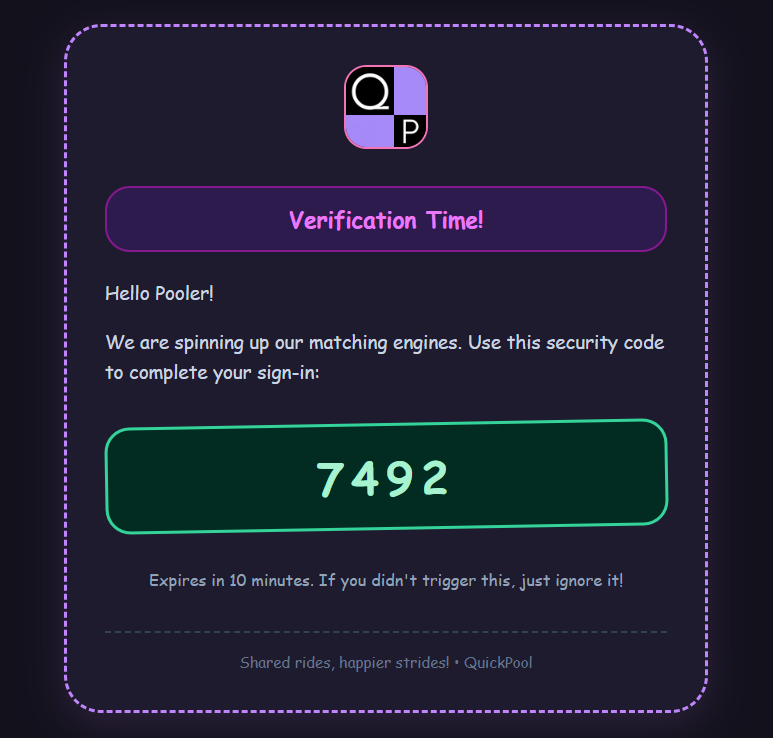
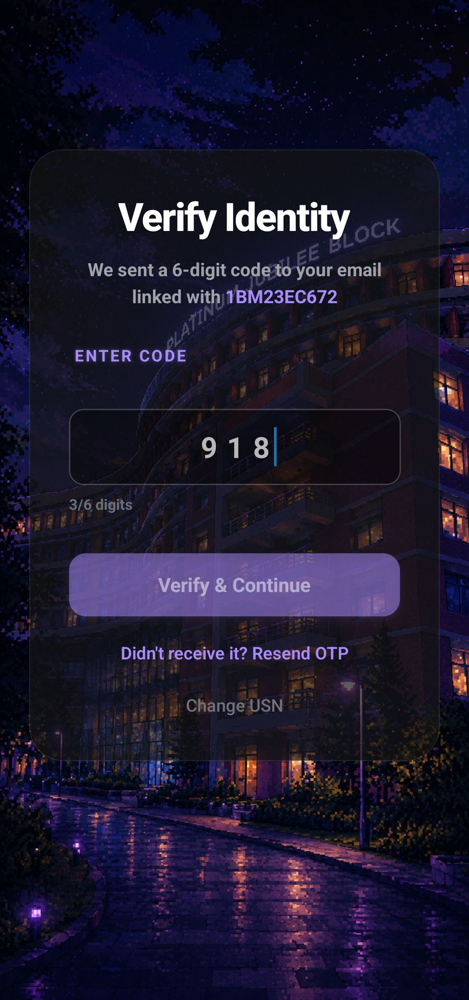

<br><br>

Secure OTP-based authentication flow using university ID verification, email verification and login confirmation.

</div>

---

### Home

<div align="center">

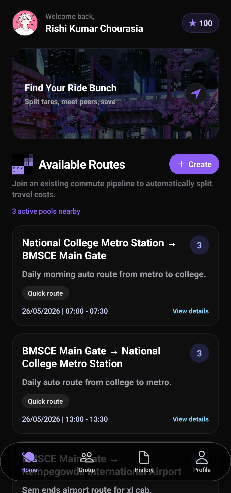

<br><br>

Browse available ride routes, discover matching users and create personalized travel routes.

</div>

---

### Routes

<div align="center">

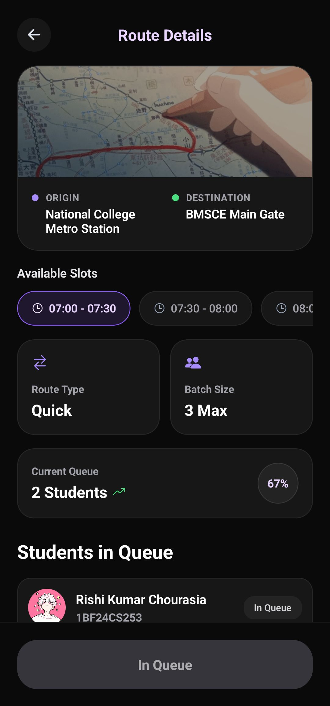
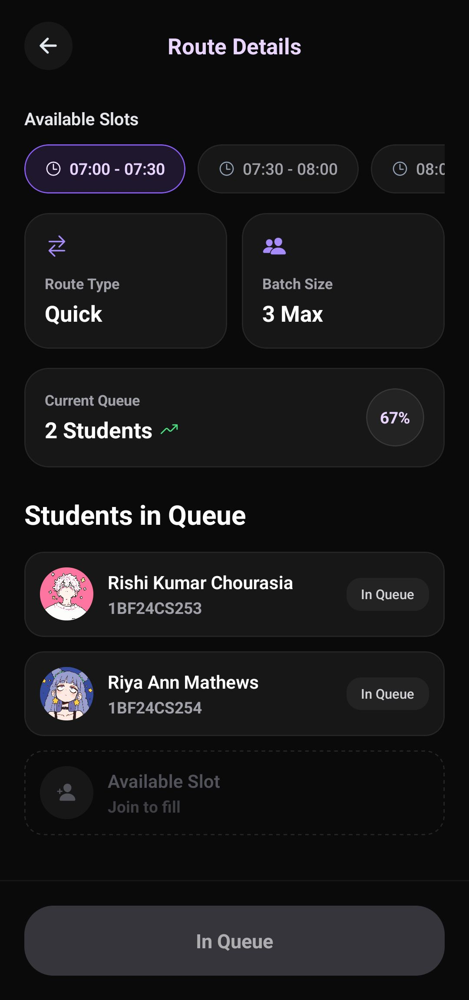

<br><br>

Choose your route and your time slot

</div>

---

### Groups

<div align="center">

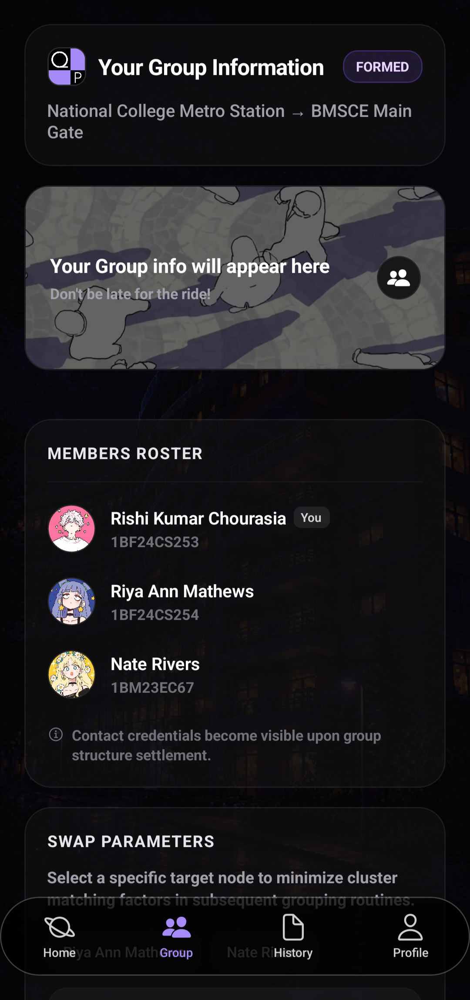
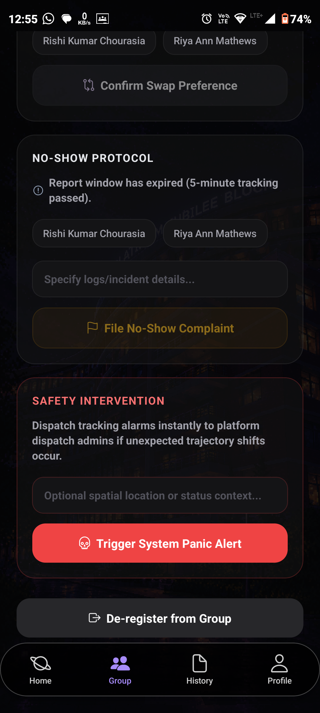

<br><br>

Manage ride groups, send panic alerts, monitor members, request swaps and handle ride participation.

</div>

---

### History & Profile

<div align="center">

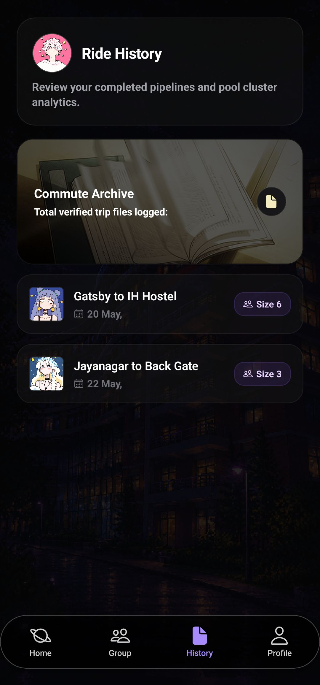
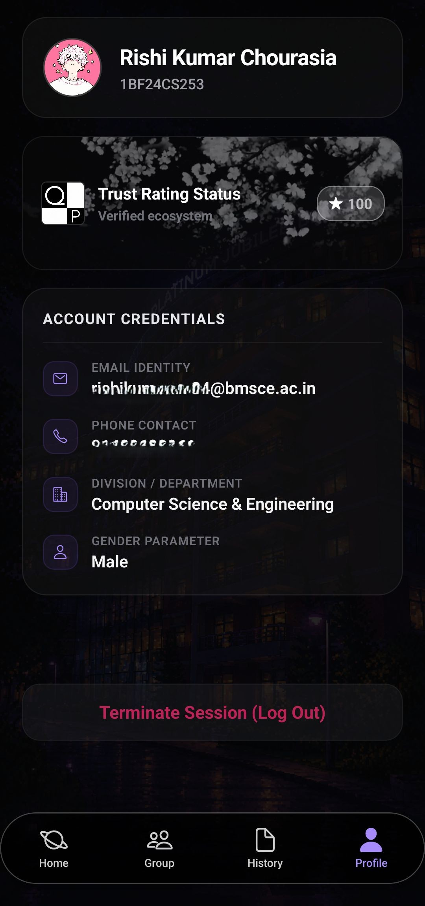

<br><br>

View previous rides, track participants and maintain ride activity records.
Manage user information, reputation score and account details.

</div>

---

### Admin Panel

<div align="center">

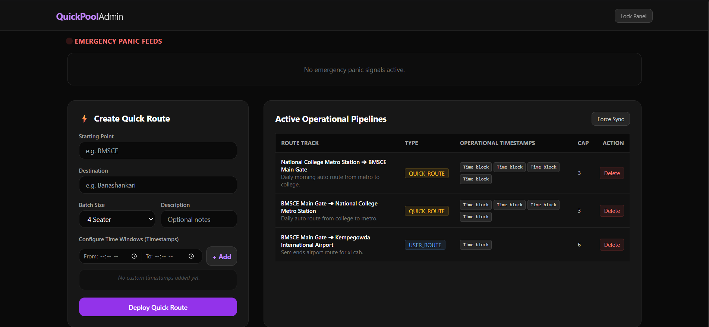
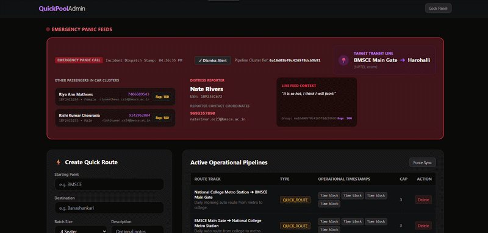

<br><br>

Monitor Routes, get panic alerts and act directly!

</div>

---

## Overview

QuickPool is a full-stack ride pooling application that automatically matches users travelling on similar routes and forms optimized ride groups.

Core goals:

- Intelligent route matching
- Automated ride grouping
- Ride safety features
- Reputation management
- Ride history tracking
- Emergency support system

---

## Features

### Authentication

- OTP-based login
- Email verification
- JWT authentication
- Secure local storage

### Route System

```ts
QUICK_ROUTE
USER_ROUTE
```

Supports:

- Source and destination
- Time slots
- Capacity selection
- Dynamic route creation

### Matching System

```txt
FORMED
↓
STARTED
↓
COMPLETED
```

Automatically:

- Finds matching routes
- Creates ride groups
- Updates ride status

### Safety

- Panic reporting
- No-show reporting
- Reputation scoring

### Ride Management

- Group management
- Ride swapping
- Ride history

---

## Tech Stack

### Frontend

```txt
React Native
Expo
TypeScript
Expo Router
Secure Store
```

### Backend

```txt
Node.js
Express
MongoDB
Mongoose
JWT
Node Cron
Nodemailer
```

---

## Architecture


<div align="center">

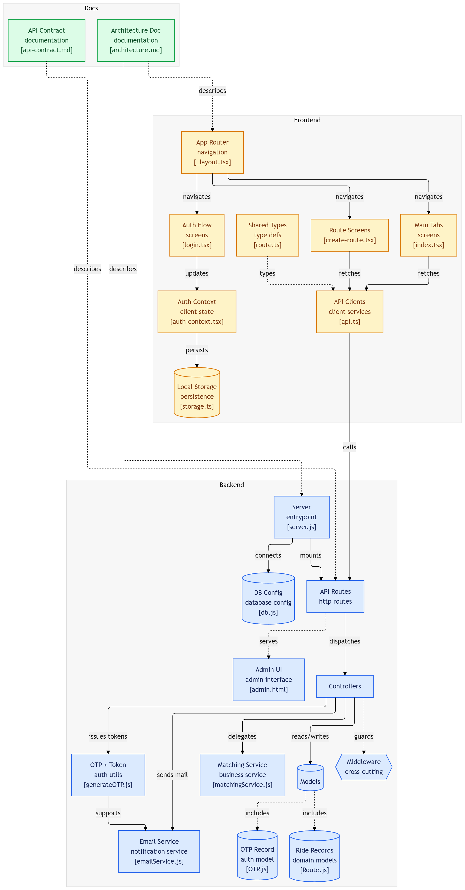

</div>

---

## Installation

### Clone repository

```bash
git clone https://github.com/not-rishi/QuickPool.git

cd QuickPool
```

### Backend

```bash
cd backend
npm install
npm run dev
```

### Frontend

```bash
cd frontend
npm install
npx expo start
```

<div align="center">

<a href="./docs/architecture.md">

</a>

<a href="./docs/api-contract.md">

</a>

</div>
